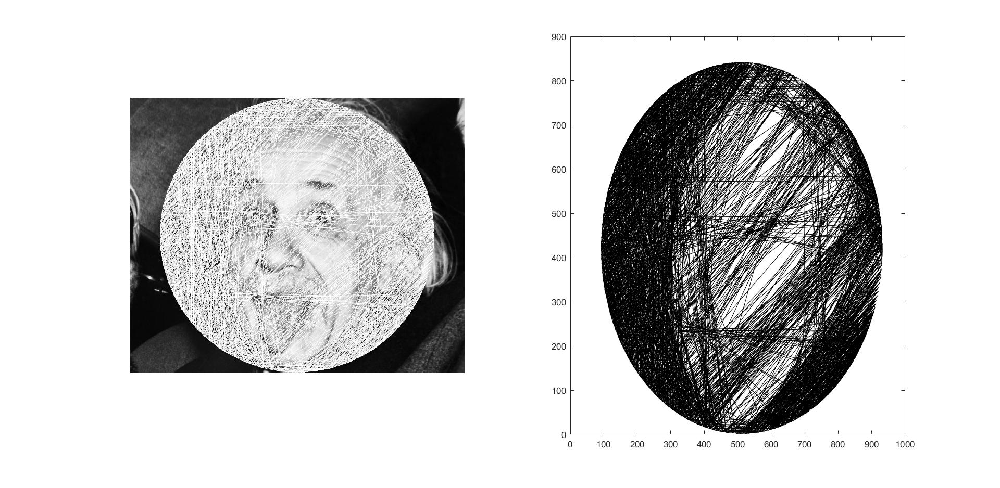

# String Art Project

This project is about my hobby; String Art. 
 

## The Idea
You can get more information about with googling ["Philography Art"](https://www.google.com/search?q=Philography%20Art "a title"), ["String Art"](https://www.google.com/search?q=String%20Art "a title")."

What I want to code is actually can named as "Computational String Art". With scripts and image processing every image can build with thread, nails and a plate. About the idea you can google with the following [link](google.com/search?q=Computational%20String%20art "a title") and check these YouTube [Video_1](https://www.youtube.com/watch?v=UsbBSttaJos "a title") / [Video_2](https://www.youtube.com/watch?v=wsO8Kso3zj4 "a title") . 

## My Input and Output
It seems like needs to be optimized. I couldn't get the best results. The idea is, in every steps finding the thread that turns black pixels to white pixels most. After finding that save it as a numbered path and giving as an output to user.

